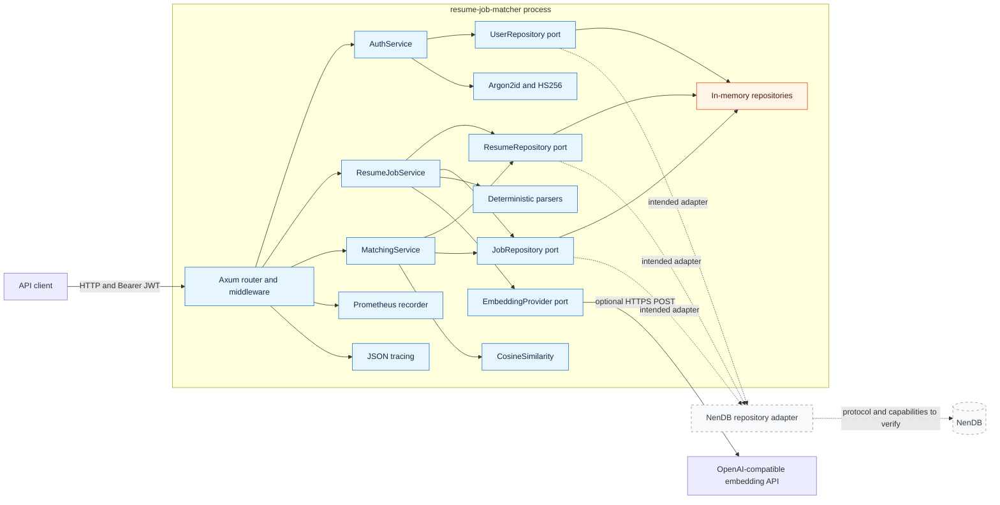

# Runtime Architecture Diagram

Solid lines show the currently compiled runtime. Dashed lines show the intended
NenDB path, which is not implemented or verified.

The current `Memory` node is process-local and loses all data on restart. The
dashed NenDB nodes describe an architectural seam only; the repository contains
no NenDB adapter, configuration, migrations, or verified runtime dependency.
