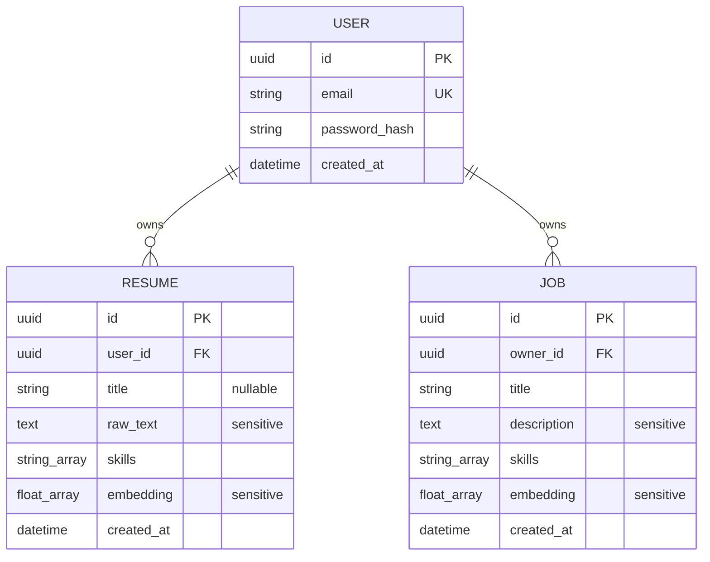

# Logical Data Model ER Diagram

This diagram represents current Rust entities and the minimum intended persistent
relationships. It is not a NenDB physical schema and does not assert foreign-key,
type, or constraint support.

Recommendations are derived in memory from a job and resume and are not an
intended initial collection. `PK`, `UK`, and `FK` express logical requirements;
their NenDB implementation and enforcement must be verified.
