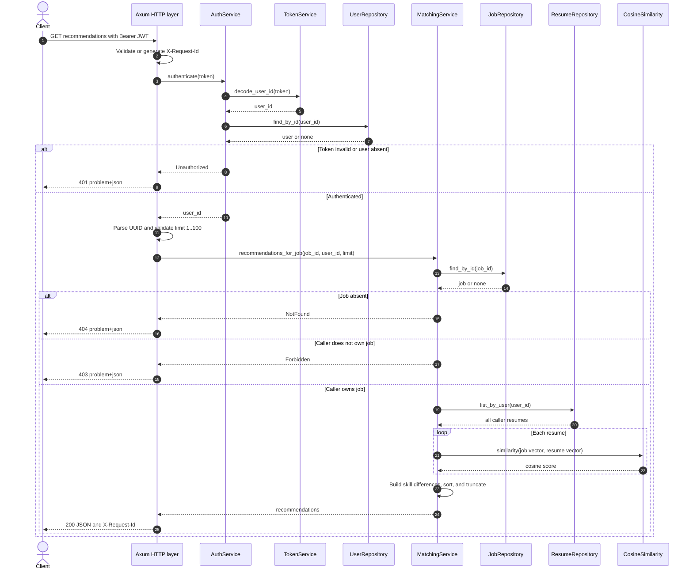

# Recommendation Request Sequence

This is the currently implemented `GET /api/v1/jobs/{job_id}/recommendations`
flow. Repository calls resolve to in-memory adapters in the compiled service.

No embedding provider call occurs during recommendation reads because vectors are
created during ingestion. A future NenDB adapter should preserve this repository
contract unless a separately designed vector-search port replaces in-process
ranking.
